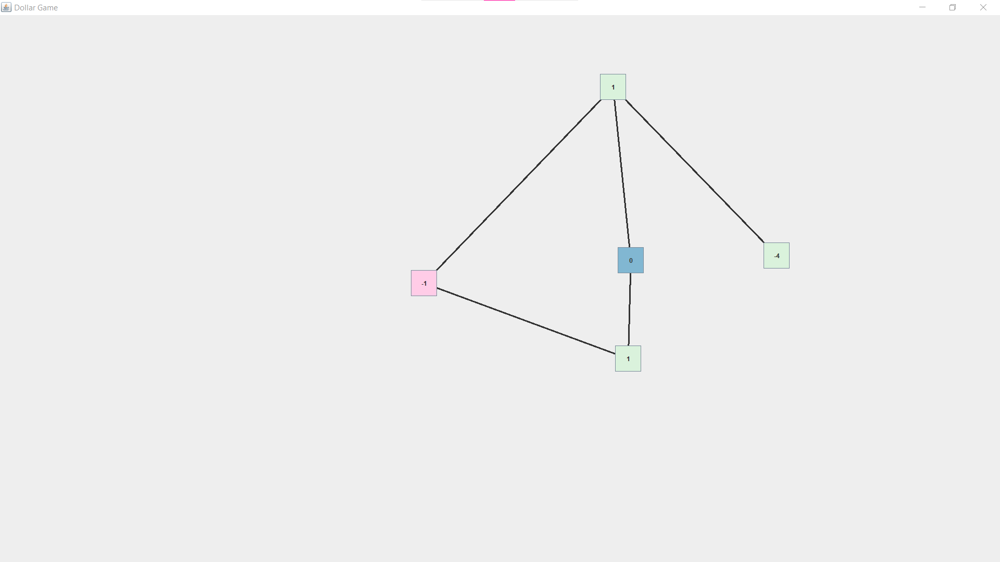

# Dollar-Game
A Game based of the [numberphile video](https://youtu.be/U33dsEcKgeQ)

To play, begin by selecting the number of vertices to be played with.

### Rules

Selecing a vertex results in it giving $1 to each of its neighbors.

The game ends if you quit out, or if you are able to get every
vertex above to have a non negative number.

